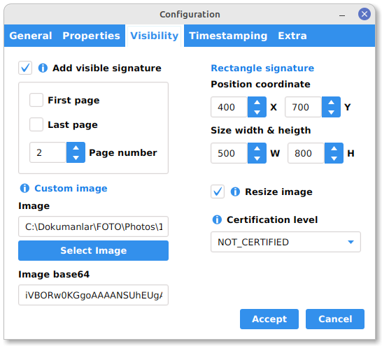

# PDFSigner

## Tabla de Contenido

- [Sobre](#about)
- [Comenzando](#getting_started)
- [Demo](#demo)

## Sobre <a name = "about"></a>

Interfaz gráfica creada con javaFX para manipular los ajustes de un firmador de pdf

## Comenzando <a name = "getting_started"></a>

### Prerequisites

- Java version: 11.0.18
- Apache Maven: 3.9.2 

### Lanzando aplicación en modo de desarrollo con Maven

```
mvn clean javafx:run
```

### Empaquetando aplicación en un archivo .jar para distribución.

Crear ejecutable

```
mvn clean package
```
Tenga en cuenta que debe de copiar el archivo de configuración `pdfsigner.properties` en el mismo directorio donde sea cree el ejecutable `pdfsigner-1.jar`

Abrir aplicación de producción

```
java -jar pdfsigner-1.jar
```

## Demo <a name = "demo"></a>
